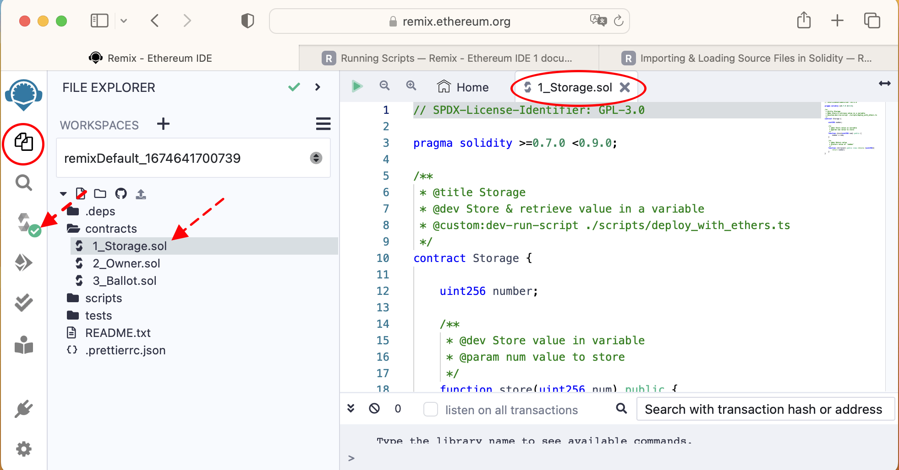

# Project-Machu Picchu Tutorial - Understand the code [1]
*(version January 2023)*

We learn here how to code blockhain smart contracts using Remix. In the [**previous chapter**](./README_2.md), we talked about our roadmap, had an overview of Remix and deployed our first contract.

In this section, we are doing our first steps in understanding and programming Solidity. We'll progress very slowly, so if you may want to skip reading if you know already Solidity. 

In the following, to get the most profit from this tutorial, after reading each line of code and its explanation, go to the Remix code editor, delete the code and type it back yourself to get used with the exact syntax.

# 1	Going further: understand the smart contract code of 1_Storage.sol
## 1.1	The full code
We'll explain the code line by line. The full code is
``` javascript
// SPDX-License-Identifier: GPL-3.0

pragma solidity >=0.7.0 <0.9.0;

/**
 * @title Storage
 * @dev Store & retrieve value in a variable
 * @custom:dev-run-script ./scripts/deploy_with_ethers.ts
 */
contract Storage {

    uint256 number;

    /**
     * @dev Store value in variable
     * @param num value to store
     */
    function store(uint256 num) public {
        number = num;
    }

    /**
     * @dev Return value 
     * @return value of 'number'
     */
    function retrieve() public view returns (uint256){
        return number;
    }
}
```
## 1.2	Practice editing and compiling the code
Here is how we will proceed:
-	We activate Remix' auto-compilation feature, to immediately check the Solidity code as soon as it is entered.
-	We create a new workspace to work on and that we can dispose of, to revert to the origin in case of mistake.
-	For each keyword introduced here, we delete the corresponding instruction, we see how the Remix auto-compile complaints (warning or error). Then we type in the instruction ourselves. We may make possible typing mistakes that the auto-compile will detect. We correct our typing until the instruction is correct.
-	We proceed to the next keyword in the next instruction.
-	If somehow you really can't restore back the original correct instruction syntax, create a new clean fresh Remix workspace of type "Default". You can then compare the faulty typed code (previous workspace) with the original (cloned workspace). After that, you delete the faulty workspace.

To activate the auto-compile, in the Menu Bar click on the icon "Solidity compiler", then in the Side panel check the box "Auto compile". 


Create a new workspace to start exploring the code. For this doing, in the Menu bar click on the "File explorer" icon, click on the workspace selector, select "– create a new workspace".


In the dialog "Choose a template", keep the proposed type "Default". Give the workspace a name or keep the proposed value. Click "OK".


We are now in a fresh workspace. To start exploring the code, keeping the Side panel "File Explorer", close all folders by clicking on their icons, excepted the folder "contracts". Select the file "1_Storage.sol". The code will appear in the Main Panel, ready for our manipulations. A green tick will also appear next to the compiler icon, which means that auto-compile has just been launched against the code in the Main Panel and auto-compiled it successfully.


## 1.3	The Solidity license identifier
The first line says

```
// SPDX-License-Identifier: GPL-3.0
```

Try and delete it. The "Solidity compiler" icon appears now with a red badge. The code in the Main Panel shows a red exclamation mark on the faulty line. In the Menu Bar, click on the icon "Solidity compiler" and in the Side Panel scroll down to read the warning message: 

```
Warning: SPDX license identifier not provided in source file.
Before publishing, consider adding a comment containing
"SPDX-License-Identifier: <SPDX-Licenses>" to each source file.
Use "SPDX-License-Identifier:
UNLICENSED" for non-open-source code. Please see https://spdx.org for more information.
--> contracts/1_Storage.sol
```


Type again the comment `// SPDX-License-Identifier: GPL-3.0`. The warning disappears. If you are curious, do a web search for "SPDX license".

Let's try the next instruction, the pragma.

## 1.4	The Solidity version qualifier "`pragma`"
The line 3 says
```
pragma solidity >=0.7.0 <0.9.0;
```
Delete it. The "Solidity compiler" icon bears a red badge. The warning message in the Side Panel says: 
```
Warning: Source file does not specify required compiler version! Consider adding "pragma solidity ^0.8.7;"
--> contracts/1_Storage.sol
```
Without the "pragma" instruction, Remix can't know which Solidity compiler version to use. The warning message suggests using version 0.8.7. The pragma in original code meant "*higher or equal to 0.7.0 and strictly lower than 0.9.0*". We'll see later that when we restrict to a specific compiler version, the compiler will complaint if our code contains a library source file that specifies a different version. So it is preferable to set a range of versions.

Retype the original instruction, with the pragma and without the ending semi-colon "`;`" and check the error message because this is the most frequent typing mistake. It says:
```
ParserError: Found version pragma, but failed to parse it.
Please ensure there is a trailing semicolon.
--> contracts/1_Storage.sol:3:1:
|
3 | pragma solidity >=0.7.0 <0.9.0
| ^ (Relevant source part starts here and spans across multiple lines).
```
Add the missing trailing colon. The compiler icon has now a green badge. Compilation succeeded.

## 1.5	The NatSpec comments
Lines 5 to 9 contain comments in a special NatSpec format. We have seen above that Remix uses a special NatSpec comment `@custom:dev-run-script` to execute a script after successful compilation. More about NatSpec later.
```
* @custom:dev-run-script ./scripts/deploy_with_ethers.ts
```
## 1.6	The "`contract`" statement
The line 10 says
```
contract Storage {
```
When we hover the mouse in the line numbering column, clicking on the caret "`>`"collapses the code block from line 10 to line 20. This feature is very useful when analyzing large contracts, to focus on specific code blocks and collapse the rest. A large blue dot on the left signals a collapsed block. It also serves as a debug breakpoint in Remix.


In Solidity, names of smart contracts start with an upper-case letter, never a lower-case and never a digit. Try prefixing the name with a digit like "`contract 1Storage`". You'll see an ERROR at line 10. It will be the same if you prefix with a lower-case character.
```
ParserError: Expected identifier but got 'ILLEGAL'
-->
contracts/1_Storage.sol: 10:10:
|
10 | contract 1Storage {
| ^
```
Try deleting the line. Check the error message. It says:
```
ParserError: Expected pragma, import directive or
contract/interface/library/struc t/enum/constant/function
definition.
-->
contracts/1_Storage.sol:29:1:
29 | }
| ^
```
It detected an error, but at the last line, line 29-character 1, the closing bracket. It's because we deleted the opening bracket "`{`" in the instruction much earlier at line 10.
Retype the correct instruction. The error message disappears.

## 1.7	The state variables
Expand the contract code block. The line 12 says 
```
    uint256 number;
```
We declare here a state variable called "`number`". The variable is called "state variable" because it is part of the state of the contract. It is reachable by all functions of this smart contract. 

Its type is "unsigned integer of 256 bits". The default variable size in Solidity is 256 bits. It matches the way the low-level Ethereum Virtual Machine (EVM) aligns memory data.

- It is possible to use variables of smaller size to spare memory but doing so generates more code once compiled. The code pads the memory slot with 0 until filling 256 bits and checks memory alignment. This code consumes memory. Use other sizes than 256 (8, 16, 32, 64) only when you master how the compiler manages memory space.

Try deleting the line. The compiler detected 2 errors at line 19 and line 27 because in these lines we use the variable "`number`" without having defined it.

Retype the original instruction, without the ending semi-colon "`;`" and check the error message because this is the most frequent typing mistake. It says:
```
ParserError: Expected '; ' but got 'function'
-=>
contracts/1_Storage.sol: 18:5:
| 
18 | function store (uint256 num)
public {
| ^^^^^^
```
It detected an error at line 18-character 5, not at the line 17 where is missing the ending semi-colon "`;`".

We observe that the error message rarely spots the right origin of the mistake. It only marks where the compiler first spots a syntax error. This makes the auto-compile feature interesting: it warns immediately whenever we type an error so that its origin stands out more. Keep an eye on the compile icon frequently, to detect an error as early as possible.

## 1.8	The function "`store`"
The line 18 says 
```
    function store(uint256 num) public {
```
In Solidity, names of functions are lower-case. This function "`store`" accepts one calling argument "`num`" of type "unsigned integer of 256 bits".

Try using other types of variables (`int256`, `bool`, `address`, `bytes32` etc.) and check the error message. Try deleting the line and check the error message. Retype the original instruction.

This function statement has the visibility qualifier "`public`". A "public" function can be called from other functions outside the contract or inside the same contract. We'll see later the other qualifiers.

The line 19 says
```
        number = num;
```
Here we assign the calling argument "`num`" to the state variable "`number`". The variable "`num`" is local to the function "`store`" and is unknown to the function "`retrieve`". Try writing an instruction using "`num`" in another function, for example in function "`retrieve`" and check the compile error message.

Try deleting the line to make an empty function (hint: it is perfectly legal).

## 1.9	The function "`retrieve`"
The line 26 says
```
    function retrieve() public view returns (uint256){
```
This function has no calling arguments. It has the visibility qualifier "`public`" like the previous function. It is of type "`view`" which means that it doesn't change the state variables of the contract. 

- The compiler will generate less checking code for a "`view`" function and its execution will cost less gas if called from the same contract, down to no gas at all if called from outside the contract.

The instruction declares one returned variable of type unsigned integer of 256 bits.

Try commenting out each word and see the error message.

## 1.10	What have we learned?
-	We know that Remix has several "workspaces"
-	We know how to make Remix compile automatically the code as you type code in the text editor. This is useful to catch bug ASAP.
-	We know how to collapse and expand blocks of the code displayed in the text editor
-	A Solidity code file has the extension `sol`.
-	A smart contract in Solidity needs to start with a comment stating the software license of the contract, in SPDX normalized syntax.
-	Solidity needs to know which version of the compiler to use, using the keyword "`pragma`".
-	A contract name starts with an upper-case letter.
-	A state variable is part of the state of the contract. It can be reached everywhere in the same contract.
-	A local variable is known only inside the scope it is declared.
-	You know some keywords used in writing function calls.

There is still a lot to learn on this topic but now it's time to read and understand the JavaScript test. Automated testing is essential when developing blockchain smart contracts.

# 2	Going further: understand the JavaScript test code
In this section, we start understanding and programming JavaScript automated tests. We'll progress very slowly because Test Driven Development (TDD) and automated testing are essential in blockchain programming. A smart contract potentially executes in thousands of Ethereum nodes. TDD makes sure that whatever business logic that has been specified has been implemented as desired in the contract.

It is so important that Remix includes by default the necessary TDD tools. No need to install and configure anything. We can run the test either by right-clicking the test script in the Side Panel and choose "Run", or by the Solidity comment `* @custom:dev-run-script ./tests/storage.test.js`.

In the following, because the Remix JavaScript interpreter doesn't do auto-compile, after reading each line of code and its explanation, unless you want to, you need not delete the code and retype it yourself.

## 2.1	The full code
The code is
``` javascript
// Right click on the script name and hit "Run" to execute
const { expect } = require("chai");
const { ethers } = require("hardhat");

describe("Automated testing Storage smart contract", function () {
  it("test initial value", async function () {
    const Storage = await ethers.getContractFactory("Storage");
    const storage = await Storage.deploy();
    await storage.deployed();
    console.log('storage deployed at:'+ storage.address)
    expect((await storage.retrieve()).toNumber()).to.equal(0);
  });
   it("test updating and retrieving updated value", async function () {
    const Storage = await ethers.getContractFactory("Storage");
    const storage = await Storage.deploy();
    await storage.deployed();
    const storage2 = await ethers.getContractAt("Storage", storage.address);
    const setValue = await storage2.store(56);
    await setValue.wait();
    expect((await storage2.retrieve()).toNumber()).to.equal(56);
  });
});
```
## 2.2	The Chai library and the Mocha test framework
If you have some JavaScript background, you may notice that the test code contains some keywords like "`describe`" and "`it`" that are not standard JavaScript. They are part of the Mocha test framework.
``` javascript
describe("Storage", function () {... });
it("test initial value", async function () {... });
```
Each "`describe`" code block contains a test suite. Each "`it`" code block contains a test case. In the editor in the Remix Main Panel, we can collapse test cases and test suites. In the picture below, the 2 test cases are collapsed, making the test suite easier to understand.
``` javascript
// Right click on the script name and hit "Run" to execute
const { expect } = require("chai");
const { ethers } = require("hardhat");

describe("Automated testing Storage smart contract", function () {
  it("test initial value", async function () {-
  });
   it("test updating and retrieving updated value", async function () {-
  });
});
```
 
Inside the "`it`" code blocks, there are also keywords that are not standard JavaScript: "`expect`", "`to`", "`equal`". They are part of the Chai test assertions library.
``` javascript
    expect(something).to.equal(a_number);
``` 
Now let's see the automated test code line by line.
## 2.3	Import the Chai library
The line 2 says
``` javascript
const { expect } = require("chai");
``` 
This is a standard JavaScript syntax used to import in the script a library (`chai`) limited to only the package `expect` from this library. We'll use it in line 20.

## 2.4	Import the Hardhat blockchain development framework
The line 3 says
``` javascript
const { ethers } = require("hardhat");
``` 
This standard JavaScript statement imports in our automated test program a library (`hardhat`) limited to only the package `ethers`.

Hardhat is a full-featured blockchain development environment. Ethers.js is a library to connect to any EVM-compatible blockchain and interact with its smart contracts. Because of their popularity, Remix makes as easy as possible for us to use them. When I started blockchain in 2016, it took me 9 months to master the scattered utilities. Today, we can use them by one single JavaScript statement as shown.

## 2.5	The `describe` code block, first argument
The describe code block is a function call with 2 arguments
``` javascript
describe("Purpose of the test suite", inline_function);
```
The first argument is a text string describing the purpose of the test suite. Try changing the text, for example from "*Storage*" into "*Automated testing Storage smart contract*".

Then in the Main Panel text editor select the tab "1_Storage.sol", change the NatSpec comment `@custom:dev-run-scripts ./scripts/deploy_with_ethers.ts` into
``` javascript
 * @custom:dev-run-script ./tests/storage.test.js
``` 
Check that compilation is successful (the "Solidity compiler" icon remains green), check that it's the smart contract that is displayed in the Main Panel, then in the Solidity compiler Side Panel, click on the button "Compile and run script". In the Console Panel, the message says:
``` console
running ./tests/storage.test.js ...
RUNS scripts/script.ts....
 Automated testing Storage smart contract
storage deployed at:0xd8b934580fcE35a11B58C6D73aDeE468a2833fa8
   ✓ test initial value (66 ms)
   ✓ test updating and retrieving updated value (66 ms)
Passed: 2
Failed: 0
Time Taken: 134 ms
```
**Congratulations**. You have deployed for the second time your smart contract and executed successfully your first automated test suite with 2 successful test cases (0 failed), without leaving Remix. Observe that the text you changed in "`describe`" code block is printed here.

You achieved in a few steps the tasks that in 2016 took me 9 months to accomplish.

## 2.6	The `describe` code block, second argument
The second argument of "`describe`" is an anonymous function, which JavaScript allows to be used as argument to function calls. You can recognize the standard JavaScript syntax used to define a function:
``` javascript
function () {  code block  };
``` 
or in more details
``` javascript
function () {    it("text string", function () {code block});    });
``` 
This brings us to the "`it`" assertions.

## 2.7	The first `it` code block
The `it` code block is itself another function call with 2 arguments like the `describe` call: a text descriptor and a function. The code is
``` javascript
  it("test initial value", async function () {
    some code
  });
```
The first 3 instructions in the code block are repeated in both test cases. They use asynchronous programming to interact with the blockchain. Together, they hide a lot of complex code that had to be learned in early days in 2016. They deploy the smart contract `Storage` on the blockchain, retrieve its JavaScript interface in the variable `storage`, ready to be used in the test assertions. 

The `async` qualifier of the function instructs JavaScript to prepare to handle some asynchronous calls in the following code block. Inside the code block we indeed see two function calls of type `await`. 
``` javascript
 6  it("test initial value", async function () {
 7    const Storage = await ethers.getContractFactory("Storage");
 8    const storage = await Storage.deploy();
 9    await storage.deployed();
10    console.log('storage deployed at:'+ storage.address)
```
-	line 6 says: "*hey, watch out, there will be some asynchronous function call(s) coming.*"
-	line 7 says "*call the function `getContractFactory` of the package `ethers` and `await`, don't execute the next instruction until you receive the result back from `getContractFactory`*".
-	line 8 says "*call the function `deploy` of the object named `Storage` (which happens to be the result of the previous line) and `await`, don't execute the next instruction until you receive the result back from `deploy`*".
-	line 9 says "*call the function `deployed()` of the object storage and await for the blockchain function to answer back*".
-	line 10 says "*print out the `address` of the object `storage`*".

What happens if you forgot the keyword `await`?

Try editing out the keyword `await` in line 8, run the script and check what is printed out. Also, to be cool, modify the `describe` text into "*Show when we forget an await...*". To run the script, in the Side Panel, right-click on the name of the file and choose "Run".


The printout says
``` javascript
RUNS tests/storage.test.js....
 Show when we forget an await...
   ✘ test initial value (97 ms)
     Message: storage.deployed is not a function
   ✓ test updating and retrieving updated value (101 ms)
Passed: 1
Failed: 1
Time Taken: 212 ms
```
The first "`it`" test case "*test initial value*" fails, saying "*`storage.deployed is not a function`*"

**Explanation**: without `await` in line 8, line 9 executes immediately after line 8 dispatched the call to `deploy()` without waiting for the result from the blockchain. Therefore nothing is stored in the variable `storage` and the call to `storage.deploy()` cannot find the function `deploy()`.

Restore the `await` in line 8 (and the text in `describe`) and run the script. All tests pass again.
``` javascript
RUNS tests/storage.test.js....
 Automated testing Storage smart contract
storage deployed at:0x5A86858aA3b595FD6663c2296741eF4cd8BC4d01
   ✓ test initial value (130 ms)
   ✓ test updating and retrieving updated value (104 ms)
Passed: 2
Failed: 0
Time Taken: 235 ms
```
After we set up the environment, line 11 is the interesting part: it executes the assertion `expect` of the Chai library.
``` javascript
expect( something ).to.equal( something_else );
```

Here, `something` is the result returned by the asynchronous blockchain call to the `retrieve()` function of the smart contract kept in `storage2`. Because when a contract is deployed, by default the state variables are set to 0, what we `retrieve` should be equal to 0.

However, a raw comparison would not be possible because the number returned by `retrieve` is an unsigned integer of 256 bits representing the number 0, which will not match the JavaScript internal representation of the same number 0. To make the comparison match, we have to convert the first into a JavaScript number, using `toNumber()`.
- As an exercise, print out the number returned by retrieve by adding the following after line 20
``` javascript
    console.log(await storage2.retrieve());
```
- Run the script. In the printout there will be the following
``` javascript
   ✓ test initial value (157 ms)
{"type":"BigNumber","hex":"0x38"} 
   ✓ test updating and retrieving updated value (97 ms)
Passed: 2
```
- The `bigNumber` 0 is represented by the hex value 0x38. This makes a direct comparison with 0 fail.

## 2.8	The second `it` code block
The code is
``` javascript
13   it("test updating and retrieving updated value", async function () {
      ...
17    const storage2 = await ethers.getContractAt("Storage", storage.address);
18    const setValue = await storage2.store(56);
19    await setValue.wait();
20    expect((await storage2.retrieve()).toNumber()).to.equal(56);
21  });
```
-	line 17 says "*get the contract named "`Storage`" (note the upper-case) from the address that is kept in the descriptor object named `storage`, wait for the returned contract interface and keep in `storage2`*".
-	line 18 says "*call the function `store` of the contract that is kept in `storage2` with the argument 56, wait for the resulting transaction details and keep it in `setValue`*".
-	line 19 says "*wait until the mining of the transaction in `setValue` is successful*" (remember that a blockchain transaction needs a few minutes to be "mined", i.e. to be inserted in a block).
- Line 20 is the interesting part: it executes the test expect of the Chai library. Same explanation as above.
``` javascript
    expect((await storage2.retrieve()).toNumber()).to.equal(56);
``` 
## 2.9	What have we learned?
-	We remember that Remix can run a JavaScript code automatically, based on a NatSpec comment in the Solidity code
-	We know that we can also make Remix run in isolation a JavaScript code in a file. Later, we will learn that this is not magic: Remix simply uses internally the library **nodeJS** that is made for that.
-	We have our first contact with Hardhat, which is a powerful blockchain programming framework.
-	We know how a test suite is built, including several test cases, and that a test suite is made of a call to a function named `describe`, with 2 arguments: a text title, and a JavaScript anonymous function.
-	We know how a test case is built, and that a test case is made of a call to a function named `it`, with 2 arguments: a text title, and a JavaScript anonymous function.
-	We know that inside a test case we use Chai assertions such as `expect`, `to` and `equal`.
-	We know that every access to the blockchain requires asynchronous programming, using an `async` function, containing `await` instructions.

The pace has been very slow for those who already know this part, but now that everybody is aligned we can progress faster with the other smart contracts **2_Owner.sol** and **3_Ballot.sol**.

Now let's understand the Solidity code of this simple smart contract "`2_Owner`":
[**Understand the code of `2_Owner.sol`**](./README_4.md)

