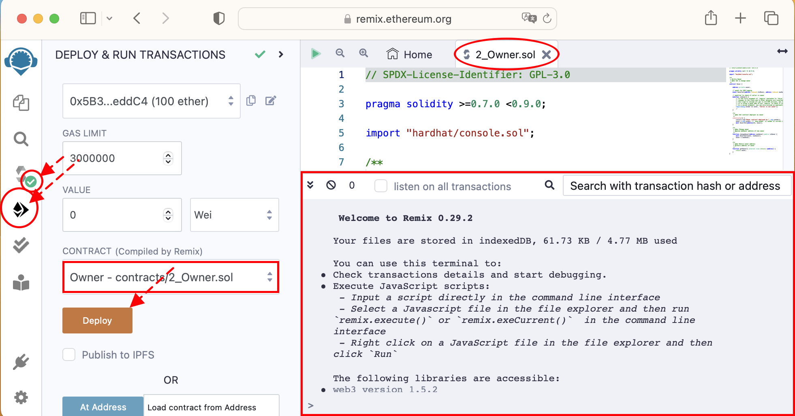
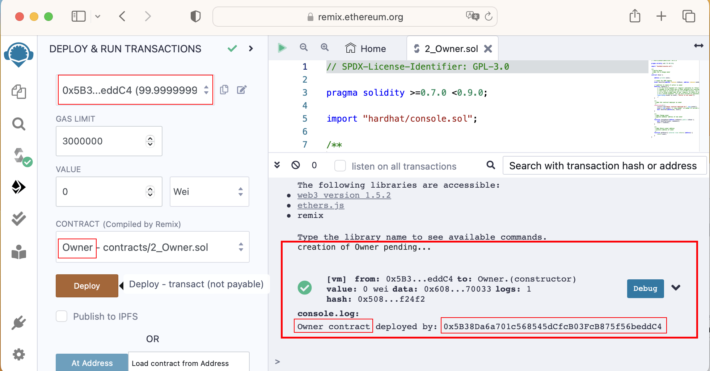
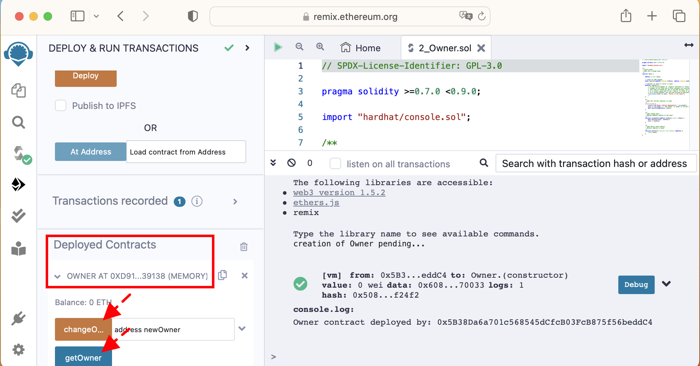
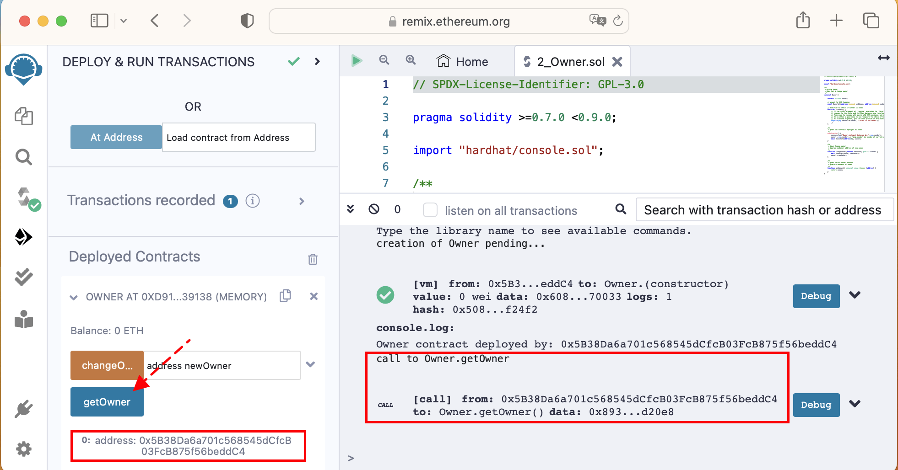
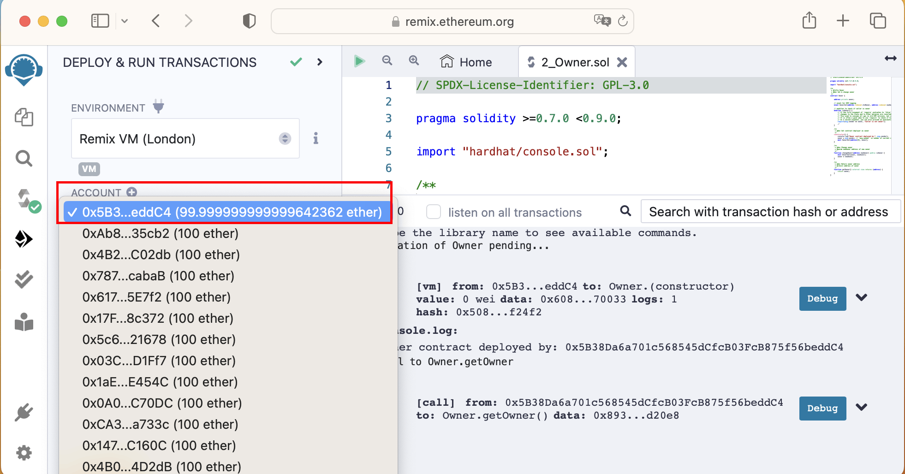
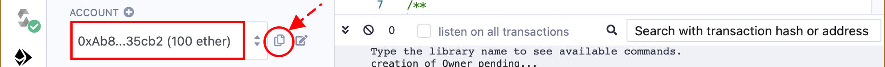
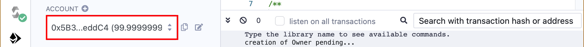
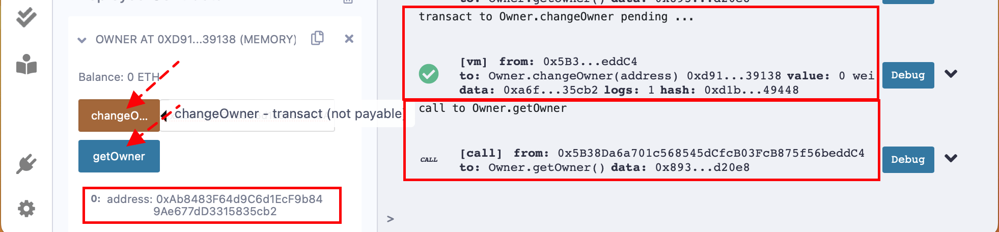
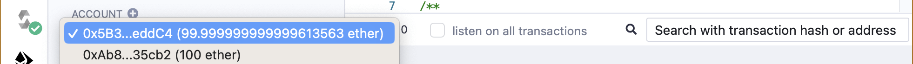
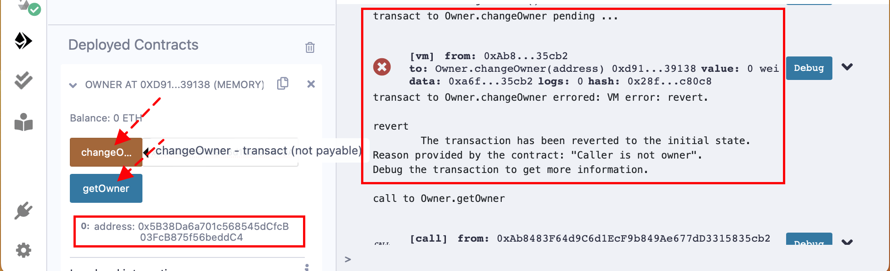

# Project-Machu Picchu Tutorial - Understand the code [2]
*(version January 2023)*

# 1	Going further: the smart contract 2_Owner.sol

In this section, we are doing our first steps in understanding and programming Solidity. Please make sure you have read [***the previous section***](./README_2.md), where we explain the tutorial curriculum and deployed "`1_Storage.sol`".

This smart contract example introduces the most frequent and recommended Solidity programming constructs. We'll exercise more of Remix: not only compile and deploy, but also use its built-in frontend to interact with the smart contract.

We'll progress faster than when explaing "`1_Storage.sol`", but if you may still want to skip reading this section if you know already Solidity.

Reminder: In the following, to get the most profit from this tutorial and the Solidity auto-compile, after reading each line of code and its explanation remember to delete the line of code in the editor and type it again yourself. You'll learn from your typing mistakes.

## 1.1	The full code
The code is longer, so we'll collapse the code blocks for an overview. We'll still explain the code line by line. The full code is
``` js
 1 // SPDX-License-Identifier: GPL-3.0
 2
 3 pragma solidity >=0.7.0 <0.9.0;
 4
 5 import "hardhat/console.sol";
 6
 7 /**-
11 contract Owner {
12 
13     address private owner;
14 
15     // event for EVM logging
16     event OwnerSet(address indexed oldOwner, address indexed newOwner);
17 
18     // modifier to check if caller is owner
19     modifier isOwner() {
27     }
28
29     /**-
32     constructor() {
36     }
37
38     /**
42     function changeOwner(address newOwner) public isOwner {
45     }
46
47     /**
51     function getOwner() external view returns (address) {
53     }
54 }
```
## 1.2	Import the Hardhat library in Solidity
Because Hardhat is a blockchain development framework written in JavaScript it was natural that our previous JavaScript test script could import Hardhat. But here in line 5, we notice that Remix makes it also possible to import Hardhat in a Solidity code. Remix uses the smart contract `console.sol` to print out text debugging messages to the console.

## 1.3	Meet more variable types
Line 13 says
``` js
    address private owner;
```
-	variable names start with a lower case, like `owner`.
-	a variable of type `address` is 256 bits long. We usually see an address as 64 hexadecimal characters, for example in MetaMask later in the tutorial.
-	 the qualifier `private` means that a state variable cannot be accessed programmatically by other smart contracts. Note that it can still be read as binary bits on the blockchain if one knows where the contract is deployed and how the contract data is organized.

## 1.4	Solidity Events and Logging
Line 16 says
``` js
    event OwnerSet(address indexed oldOwner, address indexed newOwner);
```
It defines an event named `OwnerSet` that logs 2 variables: `oldOwner` and `newOwner`. Both have the qualifier `indexed` to allow searches.

In Solidity, events can be logged with an "`emit`" instruction, like in line 43.
``` js
        emit OwnerSet(owner, newOwner);
```
- Events in Solidity is used to “print” information on the blockchain in a way that is more searchable and gas efficient than just saving to public storage variables in our smart contracts. Logs in Solidity are a special data structure on the blockchain. They cannot be accessed by smart contracts and give information about what goes on in transactions and blocks. It’s their inaccessibility to smart contracts that makes them cheaper to emit. You can specify events to be indexed, for easier searches. 

Good programming practices recommend to emit an event each time a state variable changes value.

## 1.5	Solidity `modifier` code block
A `modifier` is a special type of Solidity function that is used to modify the behavior of other functions. For example, developers can use a modifier to check that a certain condition is met before allowing the function to execute.

This code defines a "modifier" in our smart contract:
``` js
19    modifier isOwner() {
20         // If the first argument of 'require' evaluates to 'false', execution terminates and all
21         // changes to the state and to Ether balances are reverted.
22         // This used to consume all gas in old EVM versions, but not anymore.
23         // It is often a good idea to use 'require' to check if functions are called correctly.
24        // As a second argument, you can also provide an explanation about what went wrong.
25        require(msg.sender == owner, "Caller is not owner");
26        _;
27    }
```
In this example, the require function checks that the address of the account initiating the transaction (`msg.sender`) that launched the smart contract is equal to the value `owner`. If it is the case, the rest of the function calling this modifier can execute (as shows the underscore "`_`"), else the transaction is reverted and the state of the blockchain is restored as it was, before the transaction started.

The underscore can also be placed at the beginning of the modifier. When it is the case that modifier is placed at the end of a function and when this function is finished being executed, the modifier verifies that a certain condition is met.

A smart contract can define several modifiers and a function can have several modifiers.

## 1.6	Solidity `constructor` code block
A constructor in Solidity is a special function that is used to initialize state variables in a contract. The constructor is called only once, when a contract is first created. It is in general used to set initial values. A constructor can be either `public` or `internal`.

This code defines a "constructor":
``` js
32     constructor() {
33         console.log("Owner contract deployed by:", msg.sender);
34         owner = msg.sender; // 'msg.sender' is the contract deployer for a constructor
35         emit OwnerSet(address(0), owner);
36     }
```
-	Line 33 prints out via Hardhat a message with the address of the account that paid the gas fees to deploy the smart contract on the blockchain.
-	Line 34 set the variable `owner` to the address of the account that paid the gas fees to deploy the smart contract on the blockchain.
-	Line 35 emits an event. This practice is recommended whenever the state of the contract is changed. The log can be viewed in the Remix console when you expand "Debug".

## 1.7	Function `changeOwner`
The code says
``` js
42     function changeOwner(address newOwner) public isOwner {
43        emit OwnerSet(owner, newOwner);
44        owner = newOwner;
45    }
```
-	Line 42 shows the use of the `isOwner` modifier. Remember: if the address of the message sender (the account that calls this function) is not the address of the account that deployed the smart contract, the function will revert and not execute.
-	Line 43 emits the event `OwnerSet`. It will log the current owner address and the new owner address. Note that the event name starts with an upper case letter.
-	Line 44 changes the state variable `owner`. The next time we call this function from the new account, the modifier will accept it. We'll exercise this function later here.

## 1.8	Function getOwner
This function introduces the notion of a "getter" function. Such function is attached to a state variable and does only one thing: return the value of the state variable. The Solidity compiler generates automatically a getter function for each state variable declared as `public`. If the variable is declared `private`, as is the case here for `owner` in line 13, you need to write your own getter function.

The advantage of a private getter function is that you can convert and return the variable into another unit or another type, restrict the call to the getter function with a modifier etc.

The code says
``` js
51     function getOwner() external view returns (address) {
52         return owner;
53     }
```
-	Line 51 declares the function as `external`. It can't be called from inside this smart contract. Remember that `view` means that this function does not modify any state variable and its execution costs nothing in this case of an external function. It returns a variable of type `address`.

In the next step, we compile and deploy the smart contract. When running it, we'll learn to use the Remix built-in frontend to interact with the smart contract.

# 2	Going further: deploy, run the smart contract 2_Owner.sol
We repeat the previous exercise in `1_Storage.sol` to compile and deploy a smart contract in Remix. This time, we'll deploy manually instead of using the deploying script, this gives us more flexibility by decoupling compilation from deployment (and from running).
## 2.1	How to compile and deploy
To compile: 
-	Check that the file 2_Owner.sol is displayed in the Main panel. If not, in the Menu bar select the icon "File explorer" and in the Side panel select the file. 
-	If the auto-compile is on, the icon "Solidity compiler" in the Menu Bar should have a green tag. If not, something is wrong with the Solidity code, create a new default workspace and start from it.

To deploy: 
-	In the Menu bar select the icon "Deploy & run transactions". 
-	In the Side panel check the field "CONTRACT" that it indeed says "Owner - contracts/2_Owner.sol" which means that the button "Deploy" will deploy the contract "Owner" in the file "contracts/2_Owner.sol".
-	Expand the Console Panel to see more messages, we don't need the editor at this stage.
-	Click on the orange button "Deploy". 


## 2.2	Results of deployment
Once the button "Deploy" is clicked, check the Console Panel. The message printed out is 
``` console
creation of Owner pending...
[vm]from: 0x5B3...eddC4to: Owner.(constructor)value: 0 wei  data: 0x608...70033logs: 1hash: 0x508...f24f2
console.log:
Owner contract deployed by: 0x5B38Da6a701c568545dCfcB03FcB875f56beddC4
```
Note the last 2 lines were printed out by the instruction line 33.
``` js
        console.log("Owner contract deployed by:", msg.sender);
```
We see that it is useful to print out values on the console during development, to verify execution.

Observe that deploying a smart contract is nothing else than making a transaction with the blockchain. Referring to the section "Back to basics" we see that when we deploy, we made a transaction with the community of blockchain nodes, telling them "*I pay x gas fees and in exchange please you record in the blockchain that this contract is now available for execution at address xxx*". We'll see the contract address value below. 
-	**Hint**: click on the caret "V" at the right of the button "Debug". The Console expands to display lengthy details of the deployment. We are not explaining them in detail yet today.


## 2.3	How to interact with the contract from Remix
Scroll down the Side Panel. See the text "Deployed Contracts   > OWNER AT 0XD91…39138 (MEMORY)" (screen copy below). This means "*among the deployed contracts, we are now looking at the one named "OWNER" that is deployed at memory location `0xd91…39138`*"

In the Side Panel, click on the caret left of the text "OWNER AT 0XD91…39138 (MEMORY)" to expand the information. Observe the orange button labelled "changeOwner" and the blue button labelled "getOwner". This is the Remix-generated frontend to interact with our smart contract `Owner`.
-	A blue button is a function that does not change the state of the contract, a function qualified as `view` or `pure`. 
-	An orange button is a function that changes the state BUT doesn't accept any ETH, a function qualified as non-payable. 
-	A red button is a function that changes the state AND accepts ETH, a function qualified as `payable`. This kind of button also requires a "value" to be given in the field "VALUE" below the field "GAS LIMIT" before being pushed.


## 2.4	Action on button "getOwner"
Click on the blue button "getOwner". Observe that the console displays the message:
``` console
call to Owner.getOwner
CALL
[call]from: 0x5B38Da6a701c568545dCfcB03FcB875f56beddC4 to: Owner.getOwner()data: 0x893...d20e8
```
Note that, at the top of the Side panel, the address of the account that deployed and paid the gas fees is the same as the address the Console Panel is showing as address of the account considered as `owner`: `0x5B38Da6a701c568545dCfcB03FcB875f56beddC4`. It confirms that when we deployed the contract, the contract's `constructor` indeed stored the caller's address in the state variable `owner`.


## 2.5	Action on button "changeOwner"
To change the owner, we need an account address. For convenience, the sandbox blockchain of Remix also contains 15 pre-built Ethereum accounts, each one being pre-filled with 100 ETH.

We'll choose the 2nd account as new owner. We paste its address in the argument field for the function `changeOwner`. Then, with the 1st account as owner, we call this smart contract function from Remix. 

Do as below:

Scroll up, to the top of the Side Panel "Deploy & run transactions". We see there a label "ACCOUNT" and a dropdown box. Open this dropdown box. We see that there are 15 accounts. The first one is checked. Verify its address and verify that it is the same as in the variable "`owner`". Its value is lower than 100 ETH because some was already spent to deploy the contract, `0x5B38Da6a701c568545dCfcB03FcB875f56beddC4`.


Select the second address, 0xAb8483F64d9C6d1EcF9b849Ae677dD3315835cb2. Click on the icon to the right, to copy it in the clipboard.


Scroll down to paste it in the field to the right of the orange button "changeOwner". 


Scroll up to the top to select again the first address 0x5B38Da6a701c568545dCfcB03FcB875f56beddC4. 


Scroll down and click on the orange button "changeOwner". Observe the message from the console.
``` console
transact to Owner.changeOwner pending ... 
[vm]from: 0x5B3...eddC4to: Owner.changeOwner(address) 0xd91...39138value: 0 weidata: 0xa6f...35cb2logs: 1hash: 0xd1b...49448
```
Notice the difference between the previous message from the blue button "getOwner" and this message from the orange button "changeOwner". It was a "`call`" and now it is a "`transact`".

To verify the new owner, click on the blue button "getOwner". Observe the message from the console.
``` console
call to Owner.getOwner
CALL
[call]from: 0x5B38Da6a701c568545dCfcB03FcB875f56beddC4to: Owner.getOwner()data: 0x893...d20e8
```
Check that the value has changed to `0xAb8483F64d9C6d1EcF9b849Ae677dD3315835cb2`. It is the address of the 2nd account.


Observe that the 1st account has spent some additional ETH to execute the transaction changeOwner.


## 2.6	What if we call "changeOwner" from the 2nd account?
What happens if we change to the 2nd account, copy-paste its address to the parameter field of the button "changeOwner" then click on this button, without changing again to the 1st account at the top of the Side Panel?

The function `changeOwner` will be called from the 2nd account, which is not yet the Owner. The modifier will detect it and revert the transaction. We can check in the console, and also by clicking on "getOwner": the owner hasn't changed.


## 2.7	What have we learned?
-	We know how to manually deploy a smart contract and exercise the functions of this contract.
-	We know that Remix includes a welcome feature of Hardhat to print out contents of Solidity variables from smart contracts, `console.sol`.
-	We know that to exercise contracts Remix has 15 accounts pre-filled with 100 ETH each. Each time we do a transaction we spend some, except when calling `view` or `pure` functions.
-	We know that Remix generates a button for each function of a smart contract, along with input fields when the function needs parameters
-	We know that blue buttons are for functions that don't modify the state of the contract, orange buttons are for functions that change the state but don't receive ETH and red buttons for those that receive ETH (are `payable`).
-	We know how to choose which of the 15 pre-built accounts of Remix to execute a transaction and pay for it.

After a very elementary smart contract (the contract `1_Storage.sol`) that simply changes internal state, we have met a function that includes a `modifier` and a `constructor` (the contract `2_Owner.sol`).

In the next step, we'll see a contract that implements some trusted business logic and starts to be somewhat useful, the voting contract `3_Ballot.sol`. After that we are ready to change gears and build token-handling contracts, with the help of public libraries. After learning this, we can end the Solidity part of this tutorial by building Machu Picchu core. Remains to build the React frontend to finish this full-stack tutorial.


*--> more to come*